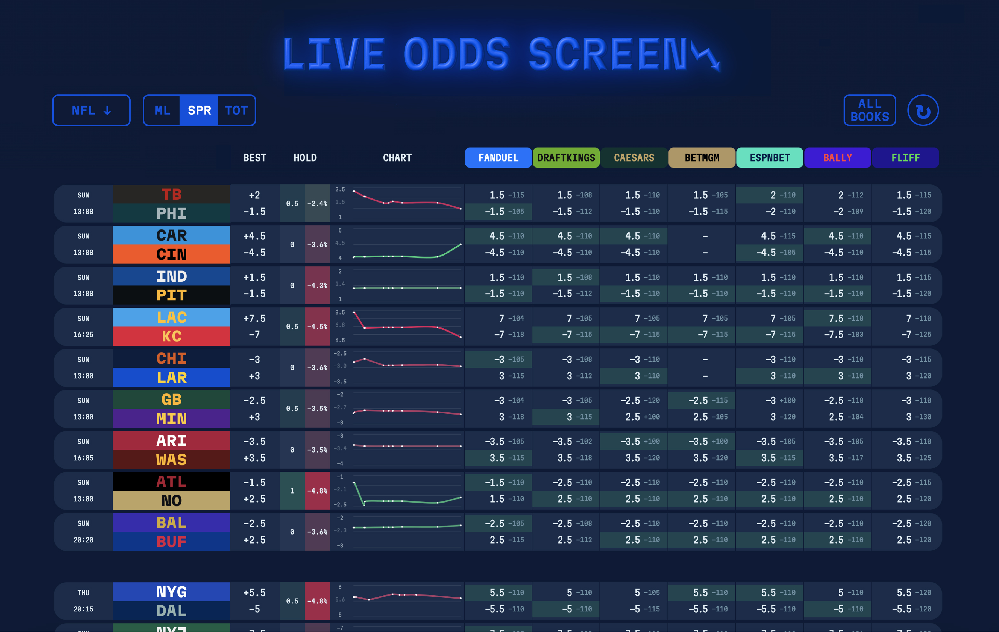
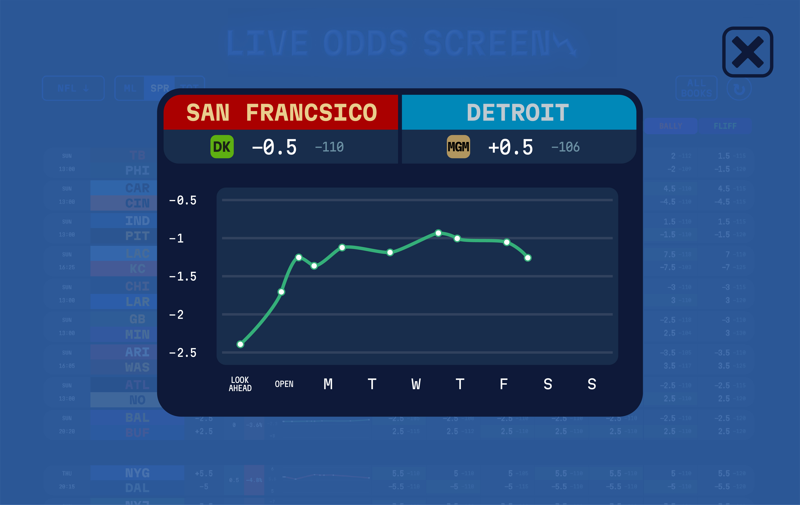

# My Odds Screen

 

React App that uses a live sports odds API to track market movement and compare prices in a user friendly way. Users can pin games they want to track and input key numbers they are looking for. Supports mainlines for major american sports.

Built with React, the-odds-api, and MongoDB.

Can't access this remotely right now because I need to learn how to deploy the backend, since gh-pages can't do that.
